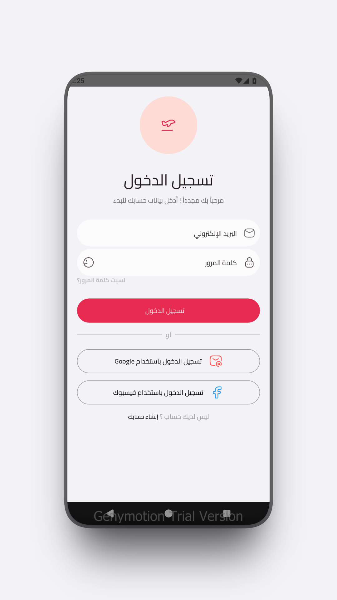
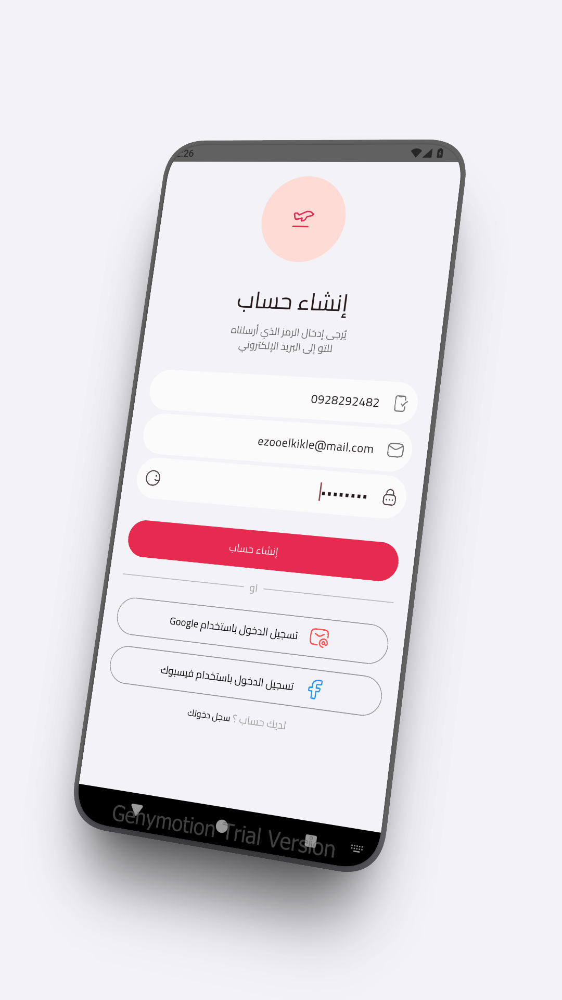
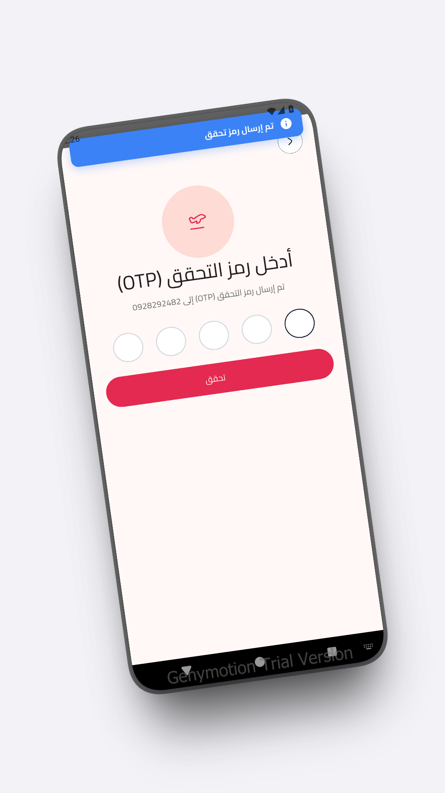
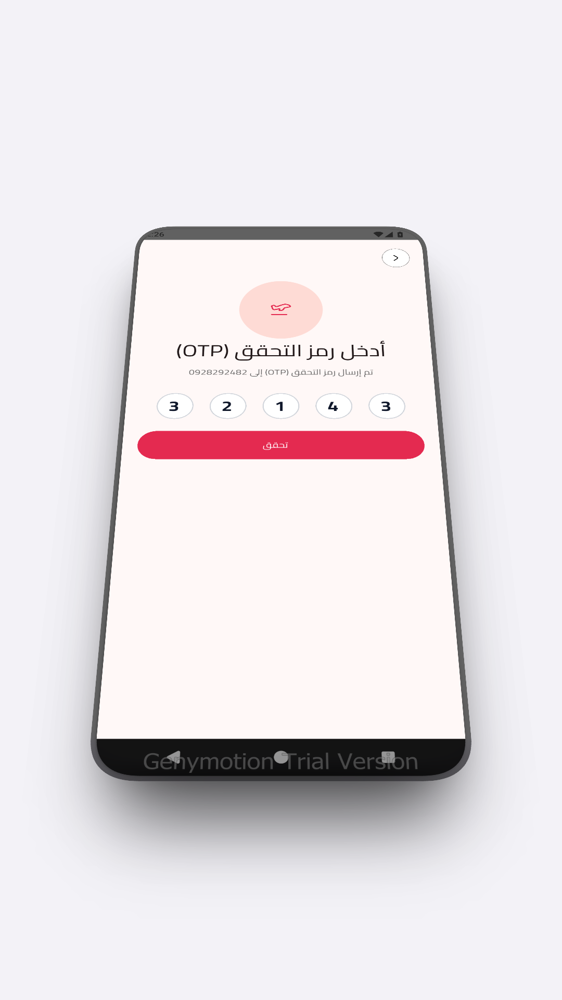

# 🔐 Flutter Authentication UI (Login, Signup & OTP)

A clean, modern, and highly responsive Authentication UI flow built with **Flutter** and **Dart**. Designed for seamless user onboarding with Login, Signup, and OTP Verification screens.

---

## 📱 App Screenshots

  
  
  
  

---

## ✨ Features
- 🎨 **Modern UI/UX:** Clean design with custom text fields and buttons.
- 📱 **Responsive Layout:** Works smoothly on various Android & iOS screen sizes.
- 🔑 **Complete Auth Flow:** Login, Signup, and OTP Verification UI.
- 🛠️ **Clean Code Architecture:** Well-structured and easily scalable codebase.

---

## 🛠️ Tech Stack & Tools
- **Framework:** [Flutter](https://flutter.dev/)
- **Language:** [Dart](https://dart.dev/)